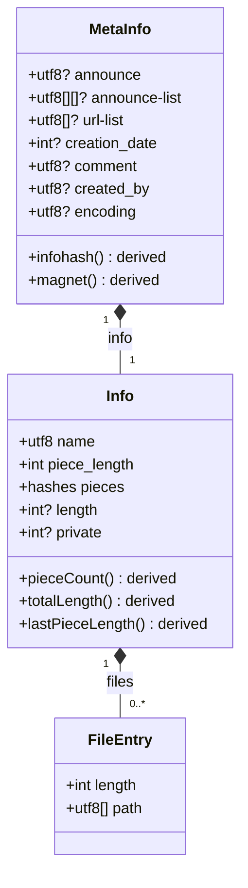
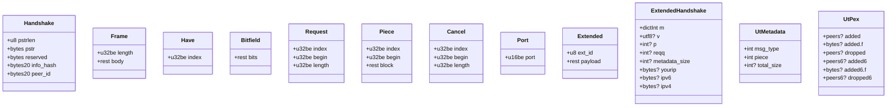

# Torrent Schema

**v0.0.2** · A machine-readable model of BitTorrent, written in JSON-LD, in the manner of [bitcoin-desktop/schema](https://github.com/bitcoin-desktop/schema): the schema is the source of truth and the code is a projection of it.

**Live:** https://play-grounds.github.io/torrent-schema/ — the schema rendered from its own documents · [torrent decoder](https://play-grounds.github.io/torrent-schema/apps/decode.html): drop a `.torrent` and the schema decodes it.

A playground, started for [utxo-swarm](https://github.com/play-grounds/utxo-swarm). Nothing depends on it yet.

## The idea

BitTorrent is specified as numbered BEPs and implemented many times over; the implementations agree because the specs are good, but there is no single document a program can read. This repo writes the protocol down as data: structures with their fields, each field with its bencode key and value type; derived values with their derivation; validity rules with their error codes. A generic codec walks the schema — it has no per-field code — and the keystone test is that it must reproduce reality byte-exactly: three real `.torrent` files (ours, Ubuntu's, Debian's) decode, re-encode to the same bytes, and yield the infohash every tracker, client and DHT node computes for them; a real tracker's answers — UDP connect, announce and scrape, HTTP announce and scrape, captured from opentrackr for our infohash — decode to the counts it reported and re-encode to the bytes it sent; and a real peer session — handshakes, extended handshakes, bitfield, request, piece, captured from a seeder through this codec — in which all 256 blocks of piece 0 were assembled and hashed to `pieces[0]`, the first bytes being the UTXO snapshot's own header. If the schema could not do that it would be documentation; because it can, it is canonical.

Done so far, bottom up:

| Document | What it models | BEP |
|---|---|---|
| [`schema/bencode.jsonld`](schema/bencode.jsonld) | the encoding: four value types, canonical form as rules with error codes | 3 |
| [`schema/metainfo.jsonld`](schema/metainfo.jsonld) | the `.torrent` file: `MetaInfo`, `Info`, `FileEntry`; derived `infohash`, `magnet`, piece counts; validity rules | 3, 9, 12, 19, 27 |
| [`schema/tracker.jsonld`](schema/tracker.jsonld) | finding peers: the HTTP announce (query and bencoded answer) and scrape, compact peers v4/v6, the UDP protocol as fixed binary layouts, the exchange rules with error codes | 3, 15, 23, 7, 48 |
| [`schema/wire.jsonld`](schema/wire.jsonld) | peer to peer: the 68-byte handshake and its reserved bits, frames and every message by id, the extension protocol (extended handshake, `ut_metadata` with its trailing bytes, `ut_pex`), the rules a peer enforces | 3, 10, 9, 11, 6, 5 |

Next, in order: the peer wire protocol (BEP 3, 10, 9, 11), web seeds as a peer (BEP 19), the DHT (BEP 5), v2 (BEP 52); then **WebTorrent as an overlay**: the WebSocket tracker protocol (announce with offers, answers by peer id) and the wire protocol over an RTCDataChannel — a de facto standard from one implementation, worth writing down for exactly that reason. See [SPEC_COVERAGE.md](SPEC_COVERAGE.md).

## Data model

The metainfo structures as a UML class diagram — **generated from [`schema/metainfo.jsonld`](schema/metainfo.jsonld)** by [`tools/gen-class-diagram.js`](tools/gen-class-diagram.js), so it can never drift. Filled diamonds are composition; `+name()` methods are **derived** values (computed from the bytes, never stored); `?` marks optional fields.



The tracker module's structures, the same way:

```mermaid
classDiagram
  direction TB
  class AnnounceRequest {
    +bytes info_hash
    +bytes peer_id
    +int port
    +int uploaded
    +int downloaded
    +int left
    +int? compact
    +int? no_peer_id
    +utf8? event
    +utf8? ip
    +int? numwant
    +utf8? key
    +utf8? trackerid
    +url() derived
  }
  class AnnounceResponse {
    +utf8? failure_reason
    +utf8? warning_message
    +int? interval
    +int? min_interval
    +utf8? tracker_id
    +int? complete
    +int? incomplete
    +int? downloaded
    +peers? peers
    +peers6? peers6
  }
  class Peer {
    +bytes? peer_id
    +utf8 ip
    +int port
  }
  class ScrapeResponse {
    +utf8? failure_reason
  }
  class ScrapeEntry {
    +int complete
    +int downloaded
    +int incomplete
    +utf8? name
  }
  class CompactPeer {
    +ip4 ip
    +u16be port
  }
  class CompactPeer6 {
    +ip6 ip
    +u16be port
  }
  class UdpConnectRequest {
    +u64be protocol_id
    +u32be action
    +u32be transaction_id
  }
  class UdpConnectResponse {
    +u32be action
    +u32be transaction_id
    +u64be connection_id
  }
  class UdpAnnounceRequest {
    +u64be connection_id
    +u32be action
    +u32be transaction_id
    +bytes20 info_hash
    +bytes20 peer_id
    +u64be downloaded
    +u64be left
    +u64be uploaded
    +u32be event
    +u32be ip
    +u32be key
    +i32be num_want
    +u16be port
  }
  class UdpAnnounceResponse {
    +u32be action
    +u32be transaction_id
    +u32be interval
    +u32be leechers
    +u32be seeders
  }
  class UdpScrapeRequest {
    +u64be connection_id
    +u32be action
    +u32be transaction_id
    +bytes20[] info_hashes
  }
  class UdpScrapeResponse {
    +u32be action
    +u32be transaction_id
  }
  class UdpScrapeCounts {
    +u32be seeders
    +u32be completed
    +u32be leechers
  }
  class UdpError {
    +u32be action
    +u32be transaction_id
    +utf8rest message
  }
  ScrapeResponse "1" *-- "1..*" ScrapeEntry : files
  UdpAnnounceResponse "1" *-- "0..*" CompactPeer : peers
  UdpScrapeResponse "1" *-- "0..*" UdpScrapeCounts : counts
```



The wire module:



## The codec

- [`codec/bencode.js`](codec/bencode.js): bencode, strict by default (canonical form enforced on input, every rule its error code), lenient on request; every decoded dictionary remembers its byte span, so the infohash is computed over the `info` dictionary **as it stands in the file**, not over a re-encoding.
- [`codec/codec.js`](codec/codec.js): `TorrentCodec` reads the schema documents; `decode('MetaInfo', bytes)`, `encode('MetaInfo', instance)`, `infohash(meta)`, `magnet(meta, infohash)`, `check(meta)` (the rules, first failure by error code), and `parse(bytes)` for all of it. Unknown keys are kept under `extra` so a file round-trips.
- [`codec/binary.js`](codec/binary.js): `BinaryCodec`, the fixed-layout codec for structs with `wireType` fields (big-endian integers, fixed bytes, IPv4/IPv6, nested structs, `repeat: toEnd`); the UDP tracker messages today, the peer wire protocol next.
- [`codec/tracker.js`](codec/tracker.js): `TrackerCodec` — `announceUrl`, `scrapeUrl`, `parseAnnounce`, `parseScrape` (the rules applied, every error by its code), `udpEncode`/`udpDecode` (length, action and transaction id checked), compact peers both ways.
- [`codec/wire.js`](codec/wire.js): `WireCodec` — the handshake (reserved bits as `supports`), `frame`/`feed` (whole frames out of a stream, partial ones kept, over-long ones refused), bitfields both ways with the spare-bit rule, the extension protocol (`extendedHandshake`, `readExtended` with the receiver's id table, `utMetadata` with trailing bytes).
- [`codec/hash.js`](codec/hash.js): SHA-1 and SHA-256 on WebCrypto, so the same files run in Node and the browser.
- [`apps/decode.html`](apps/decode.html): the decoder page; [`apps/browse.js`](apps/browse.js): the front page, which renders whatever is in `schema/`.

```js
import { TorrentCodec } from './codec/codec.js';
const codec = new TorrentCodec(bencodeDoc, metainfoDoc);
const t = await codec.parse(bytes);   // { meta, infohash, magnet, pieceCount, totalLength, lastPieceLength, error }
```

## Tests

`npm test` — [`test/bencode.test.js`](test/bencode.test.js) (the BEP 3 examples, each canonical-form rule, round trips) and [`test/metainfo.test.js`](test/metainfo.test.js) (the three vectors in [`test/vectors/`](test/vectors/): infohash, fields, byte-exact re-encoding; the infohash unchanged by anything outside `info` and changed by anything inside it; every rule's error code; a multi-file torrent) and [`test/tracker.test.js`](test/tracker.test.js) (the captured exchanges in [`test/vectors/tracker/`](test/vectors/tracker/): requests re-encode to the bytes sent, responses decode to the counts reported and re-encode byte-exactly, every exchange rule by its code — including opentrackr's HTML answer to a non-compact announce) and [`test/wire.test.js`](test/wire.test.js) (the captured session in [`test/vectors/wire/`](test/vectors/wire/): handshakes, frames, the bitfield, the first block of piece 0 beginning `utxo\xff`, the extended handshakes, ut_metadata and ut_pex).

AGPL-3.0-or-later. Independent community project; not affiliated with the BitTorrent or WebTorrent projects.
